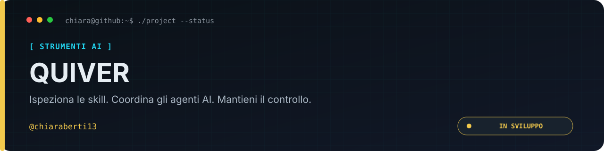

<p align="center">
  
</p>

<p align="center"><a href="README.md">🇬🇧 English</a> · <a href="README.it.md">🇮🇹 Italiano</a></p>

<p align="center">
  
  
  
  
  
</p>

# QUIVER

> Ispeziona le skill. Coordina gli agenti AI. Mantieni il controllo.
>
> Un ecosistema local-first, indipendente dai provider, con due prodotti autonomi:
> **Skills Hub** e **Orchestrator**, collegati solo attraverso un bridge facoltativo.

<p align="center"><a href="docs/README.it.md"><strong>Documentazione</strong></a> · <a href="roadmap.md">Roadmap</a> · <a href="CONTRIBUTING.it.md">Contribuire</a> · <a href="SECURITY.it.md">Sicurezza</a> · <a href="https://github.com/chiaraberti13/QUIVER/issues">Segnalazioni</a></p>

> [!IMPORTANT]
> **Sviluppo iniziale — fase scaffold.** Il repository contiene le fondamenta del
> workspace e degli strumenti di qualità. Ispezione, analisi, installazione delle
> skill, esecuzione degli agenti e interfaccia web non sono ancora operative.

## Navigazione rapida

- [Cos'è QUIVER?](#cosè-quiver)
- [Cosa esiste oggi?](#cosa-esiste-oggi)
- [Configurazione per lo sviluppo](#configurazione-per-lo-sviluppo)
- [Principi di sicurezza](#principi-di-sicurezza)
- [Documentazione e roadmap](#documentazione-e-roadmap)
- [Licenza](#licenza)

## Cos'è QUIVER?

Gli Agent Skills raccolgono istruzioni, script e riferimenti per gli agenti AI.
QUIVER nasce per aiutare gli sviluppatori a conoscere origine, contenuti,
capacità e versione precisa di una skill prima di scegliere se usarla.

| Prodotto               | Obiettivo                                                                                                                      | Stato                                               |
| ---------------------- | ------------------------------------------------------------------------------------------------------------------------------ | --------------------------------------------------- |
| **Skills Hub**         | Scoprire, ispezionare, analizzare, versionare e installare snapshot immutabili, con fiducia legata al contenuto e provenienza. | Specificato; solo scaffold dei pacchetti.           |
| **Orchestrator**       | Coordinare agenti, ruoli, permessi, flussi di lavoro, pianificazioni e budget tra provider.                                    | Specificato; solo scaffold di runtime e adattatori. |
| **Integration Bridge** | Collegare facoltativamente snapshot fissati agli agenti e riconciliarne le capacità con i permessi.                            | Specificato; solo scaffold del pacchetto.           |

Nessuno dei due prodotti richiede l'altro. Sono previsti adattatori per Anthropic,
OpenAI, Google, Ollama e LM Studio; le directory non indicano integrazioni già
funzionanti. Leggi la [panoramica del prodotto](docs/presentation/overview.it.md).

## Cosa esiste oggi?

- Un monorepo pnpm con pacchetti applicativi, di dominio, condivisi, provider e bridge.
- Configurazione TypeScript strict e comandi di typecheck per i pacchetti.
- ESLint, Prettier e fixture per verificare specifiche regole di lint sulla sicurezza.
- Strumenti fissati e restrizioni all'installazione delle dipendenze in [`.npmrc`](.npmrc).
- Specifica di prodotto, roadmap di sviluppo e decisioni tecniche.
- Questa presentazione bilingue, con banner localizzati e documentazione pubblica.

Non ci sono release o un prodotto eseguibile. Alla radice non esistono script
`build`, `test`, `start` o `dev`, e non ci sono ancora workflow CI nel repository.
I controlli dello scaffold non dimostrano copertura dello scanner o sicurezza del
runtime. Vedi lo [stato dello sviluppo](docs/presentation/development-status.it.md).

## Configurazione per lo sviluppo

Installa Git, una versione di Node.js accettata (**22.x o 24.x**) e **pnpm 10.28.0**.
La versione esatta raccomandata di Node è in [`.nvmrc`](.nvmrc); l'intervallo
transitorio accettato è in [`package.json`](package.json) e
[ADR 0001](docs/adr/0001-stack.md).

```bash
git clone https://github.com/chiaraberti13/QUIVER.git
cd QUIVER
pnpm install --frozen-lockfile
pnpm typecheck
pnpm lint
pnpm lint:fixtures
pnpm format:check
```

Questi comandi preparano e controllano il workspace di sviluppo; non avviano
un'applicazione. Gli script di ciclo di vita delle dipendenze sono disabilitati.

## Principi di sicurezza

Il progetto prevede ispezione statica delle skill, fiducia legata al contenuto,
permessi espliciti dei provider, costi controllati e azioni verificabili.
Questi controlli di runtime devono ancora essere implementati e verificati.
Il risultato di una scansione non deve essere presentato come garanzia universale
di sicurezza. Leggi [ambito e segnalazioni](SECURITY.it.md) e la
[specifica tecnica di sicurezza](project.md#part-b--security).

## Documentazione e roadmap

[Panoramica](docs/presentation/overview.it.md) ·
[Architettura](docs/presentation/architecture.it.md) ·
[Stato attuale](docs/presentation/development-status.it.md) ·
[Tutta la documentazione](docs/README.it.md)

La documentazione pubblica è disponibile in inglese e italiano. Codice sorgente,
UI del runtime, specifiche tecniche, ADR e [`roadmap.md`](roadmap.md) restano in
inglese. La localizzazione del runtime non rientra in questo lavoro documentale.
Vedi [ADR 0004](docs/adr/0004-bilingual-public-documentation.md).

I contributi usano branch dedicati e pull request. Consulta
[CONTRIBUTING.it.md](CONTRIBUTING.it.md) prima di modificare codice o documentazione.

## Licenza

Non è ancora presente un file `LICENSE`. La decisione sulla licenza è in attesa
nel [task P0-T016 della roadmap](roadmap.md#p0-t016--legal-quiver-license).
QUIVER non eredita badge o dichiarazioni di licenza dagli altri repository.
