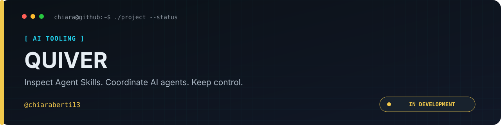

<p align="center">
  
</p>

<p align="center"><a href="README.md">🇬🇧 English</a> · <a href="README.it.md">🇮🇹 Italiano</a></p>

<p align="center">
  
  
  
  
  
</p>

# QUIVER

> Inspect Agent Skills. Coordinate AI agents. Keep control.
>
> A local-first, provider-agnostic ecosystem with two independent products:
> **Skills Hub** and **Orchestrator**, connected only through an optional bridge.

<p align="center"><a href="docs/README.md"><strong>Documentation</strong></a> · <a href="roadmap.md">Roadmap</a> · <a href="CONTRIBUTING.md">Contributing</a> · <a href="SECURITY.md">Security</a> · <a href="https://github.com/chiaraberti13/QUIVER/issues">Issues</a></p>

> [!IMPORTANT]
> **Early development — scaffold stage.** The repository has workspace and
> quality-tooling foundations. Skills inspection, scanning, installation,
> agent execution and the web interface are not operational yet.

## Quick navigation

- [What is QUIVER?](#what-is-quiver)
- [What exists today?](#what-exists-today)
- [Development setup](#development-setup)
- [Security principles](#security-principles)
- [Documentation and roadmap](#documentation-and-roadmap)
- [Licence](#licence)

## What is QUIVER?

Agent Skills package instructions, scripts and references for AI agents. QUIVER
is being built to help developers understand a skill's origin, contents,
capabilities and exact version before choosing to use it.

| Product                | Intended purpose                                                                                                 | Status                                         |
| ---------------------- | ---------------------------------------------------------------------------------------------------------------- | ---------------------------------------------- |
| **Skills Hub**         | Discover, inspect, scan, version and install immutable skill snapshots, with content-bound trust and provenance. | Specified; package scaffolds only.             |
| **Orchestrator**       | Coordinate agents, roles, permissions, workflows, schedules and budgets across providers.                        | Specified; runtime and adapter scaffolds only. |
| **Integration Bridge** | Optionally attach pinned skill snapshots to agents and reconcile their capabilities with permissions.            | Specified; package scaffold only.              |

Neither product requires the other. Provider adapters are planned for Anthropic,
OpenAI, Google, Ollama and LM Studio; the directories do not indicate working
integrations. Read the [product overview](docs/presentation/overview.md).

## What exists today?

- A pnpm monorepo with application, domain, shared, provider and bridge packages.
- Strict TypeScript configuration and package typecheck commands.
- ESLint, Prettier and fixture checks for specific security lint rules.
- Pinned tooling and dependency-install restrictions in [`.npmrc`](.npmrc).
- A product specification, development roadmap and engineering decisions.
- This bilingual presentation, with localized banners and public documentation.

No release or runnable product is available. There is no root `build`, `test`,
`start` or `dev` script, and no CI workflow is committed yet. Do not infer scanner
coverage or runtime security from scaffold checks. See
[development status](docs/presentation/development-status.md).

## Development setup

Install Git, an accepted Node.js line (**22.x or 24.x**) and **pnpm 10.28.0**.
The recommended exact Node version is recorded in [`.nvmrc`](.nvmrc); the
transitional accepted range is in [`package.json`](package.json) and
[ADR 0001](docs/adr/0001-stack.md).

```bash
git clone https://github.com/chiaraberti13/QUIVER.git
cd QUIVER
pnpm install --frozen-lockfile
pnpm typecheck
pnpm lint
pnpm lint:fixtures
pnpm format:check
```

These commands prepare and check the development workspace; they do not start
an application. Dependency lifecycle scripts are disabled by default.

## Security principles

The design targets static skill inspection, trust tied to exact content,
explicit provider permissions, controlled spending and auditable actions.
These runtime controls still require implementation and verification.
A scan result must never be presented as a universal safety guarantee.
Read [security scope and reporting](SECURITY.md) and the
[technical security specification](project.md#part-b--security).

## Documentation and roadmap

[Overview](docs/presentation/overview.md) ·
[Architecture](docs/presentation/architecture.md) ·
[Current status](docs/presentation/development-status.md) ·
[All documentation](docs/README.md)

Public documentation is available in English and Italian. Source code,
runtime UI, engineering specifications, ADRs and [`roadmap.md`](roadmap.md) remain
in English. Runtime localization is outside this documentation work.
See [ADR 0004](docs/adr/0004-bilingual-public-documentation.md).

Contributions use dedicated branches and pull requests. Consult
[CONTRIBUTING.md](CONTRIBUTING.md) before changing code or documentation.

## Licence

QUIVER is distributed under the **MIT License**. See [`LICENSE`](LICENSE) for the full terms. Third-party dependencies and referenced provider SDKs remain subject to their own licences.
