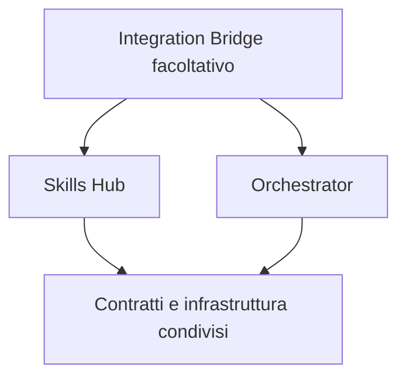

# Architettura

[English](architecture.md) · [Italiano](architecture.it.md) · [Documentazione](../README.it.md)

Questa è l'architettura prevista. Le directory esistono, ma gli entry point
applicativi sono segnaposto; il diagramma non rappresenta servizi distribuiti.

Skills Hub gestisce il ciclo di vita delle skill; Orchestrator gestisce agenti e
flussi di lavoro. Solo il bridge può dipendere da entrambi i domini. I pacchetti
condivisi devono contenere infrastruttura e contratti, senza la logica dei due
prodotti. Il controllo automatico dei confini è ancora un punto della roadmap.

## Mappa del repository

| Directory                                                                      | Responsabilità prevista                                                   | Stato attuale             |
| ------------------------------------------------------------------------------ | ------------------------------------------------------------------------- | ------------------------- |
| `apps/cli`, `apps/server`, `apps/web`                                          | Interfacce a riga di comando, API locale e browser.                       | Scaffold TypeScript.      |
| `packages/skill-*`                                                             | Importazione, snapshot, analisi, sorgenti e destinazioni d'installazione. | Pacchetti segnaposto.     |
| `packages/agent-runtime`, `workflow-engine`, `scheduler`                       | Ciclo di vita degli agenti, flussi e pianificazione.                      | Pacchetti segnaposto.     |
| `packages/contracts`, `events`, `database`, `security`, `sandbox`, `git`, `ui` | Contratti e infrastruttura condivisi.                                     | Pacchetti segnaposto.     |
| `providers/`                                                                   | Adattatori Anthropic, OpenAI, Google, Ollama e LM Studio.                 | Adattatori segnaposto.    |
| `integrations/orchestrator-skills`                                             | Bridge facoltativo tra i due prodotti.                                    | Pacchetto segnaposto.     |
| `tests/`                                                                       | Fixture dei controlli di lint e futuri test di prodotto.                  | Fixture di lint presenti. |
| `docs/`                                                                        | Guide pubbliche, decisioni tecniche e rapporti di verifica.               | Documentazione presente.  |

## Tecnologie

TypeScript strict, workspace pnpm e strumenti di lint/formattazione sono configurati.
Fastify, React/Vite, Commander, SQLite, Zod, Vitest e Playwright sono scelte della
specifica, non capacità di prodotto installate. Vedi [project.md §45](../../project.md#45-stack).

Confini di sicurezza, primitive sicure, applicazione dei permessi dei provider e
test di prodotto devono essere implementati e verificati prima di dichiarare
garanzie sul runtime. Vedi lo [stato dello sviluppo](development-status.it.md).
