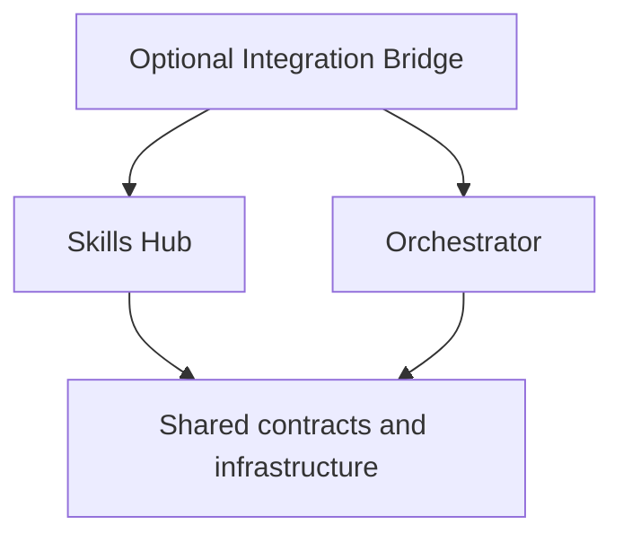

# Architecture

[English](architecture.md) · [Italiano](architecture.it.md) · [Documentation](../README.md)

This is the intended architecture. The directories exist, but their application
entry points are placeholders; the diagram does not represent deployed services.

Skills Hub owns the skill lifecycle; Orchestrator owns agent execution and
workflows. Only the bridge may depend on both domains. Shared packages must
contain infrastructure and contracts, without either product's domain logic.
Automated enforcement of these boundaries is still a roadmap task.

## Repository map

| Directory                                                                      | Planned responsibility                                            | Current state         |
| ------------------------------------------------------------------------------ | ----------------------------------------------------------------- | --------------------- |
| `apps/cli`, `apps/server`, `apps/web`                                          | Command-line, local API and browser interfaces.                   | TypeScript scaffolds. |
| `packages/skill-*`                                                             | Ingestion, snapshots, scanning, sources and installation targets. | Package placeholders. |
| `packages/agent-runtime`, `workflow-engine`, `scheduler`                       | Agent lifecycle, workflows and scheduling.                        | Package placeholders. |
| `packages/contracts`, `events`, `database`, `security`, `sandbox`, `git`, `ui` | Shared contracts and infrastructure.                              | Package placeholders. |
| `providers/`                                                                   | Anthropic, OpenAI, Google, Ollama and LM Studio adapters.         | Adapter placeholders. |
| `integrations/orchestrator-skills`                                             | Optional bridge between the two products.                         | Package placeholder.  |
| `tests/`                                                                       | Lint guardrail fixtures and future product tests.                 | Lint fixtures exist.  |
| `docs/`                                                                        | Public guides, engineering decisions and verification reports.    | Documentation exists. |

## Technology

Strict TypeScript, pnpm workspaces and lint/format tooling are configured.
Fastify, React/Vite, Commander, SQLite, Zod, Vitest and Playwright are specified
choices, not installed product capabilities. See [project.md §45](../../project.md#45-stack).

Security boundaries, safe primitives, provider permission enforcement and the
product test suite must be implemented and verified before runtime guarantees
can be made. See [development status](development-status.md).
